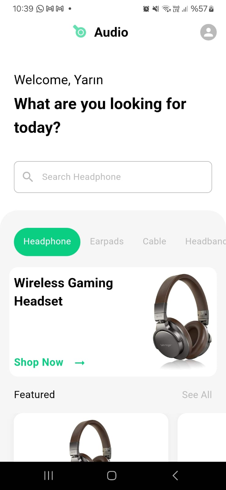

# E-Commerce App with Flutter

## Project Screens

     

## Packages
- State Management
  - [Bloc](https://bloclibrary.dev/)
- Routing
  - [Auto Route](https://pub.dev/packages/auto_route)
- Dependency Injection
  - [GetIt](https://pub.dev/packages/get_it)
  - [Injectable](https://pub.dev/packages/injectable)
- Serialization
  - [Freezed](https://pub.dev/packages/freezed)
  - [Json Serializable](https://pub.dev/packages/json_serializable)
- Logger
  - [logger](https://pub.dev/packages/logger)
- Database
  - [firestore](https://pub.dev/packages/cloud_firestore)
